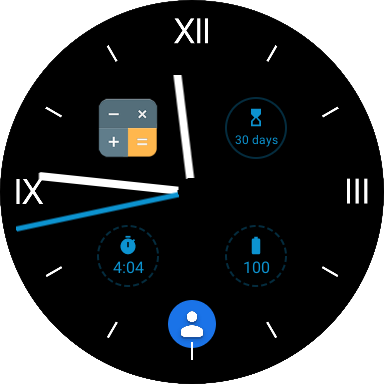

Clock View
====================

A View that displays a clock.
Supports WearOS watchfaces and widgets.




Where to Download
-----------------
```groovy
dependencies {
  implementation 'com.xlythe:clock-view:2.0.4'
}
```

Permissions
-----------------
WearOS apps require following permissions in AndroidManfiest.xml
```xml
<uses-permission android:name="android.permission.WAKE_LOCK" />
<uses-permission android:name="com.google.android.permission.PROVIDE_BACKGROUND" />
<uses-permission android:name="com.google.android.wearable.permission.RECEIVE_COMPLICATION_DATA" />
<uses-feature android:name="android.hardware.type.watch" android:required="false" />
```

ClockView
-----------------
```xml
<com.xlythe.view.clock.ClockView xmlns:android="http://schemas.android.com/apk/res/android"
    xmlns:clock="http://schemas.android.com/apk/res-auto"
    android:id="@+id/clockView"
    android:layout_width="match_parent"
    android:layout_height="match_parent"
    android:background="#ffe3e3e3">

    <TextView
        android:id="@id/clock_time"
        android:layout_width="wrap_content"
        android:layout_height="wrap_content"
        android:layout_gravity="center"
        android:textSize="40sp"
        android:textColor="#ffffffff"/>

    <ImageView
        android:src="@drawable/tick_roman"
        android:layout_width="match_parent"
        android:layout_height="match_parent" />

    <com.xlythe.view.clock.ClockHandView
        android:id="@id/clock_hours"
        android:src="@drawable/hour_hand"
        android:layout_width="wrap_content"
        android:layout_height="match_parent"
        android:layout_gravity="center_horizontal" />

    <com.xlythe.view.clock.ClockHandView
        android:id="@id/clock_minutes"
        android:src="@drawable/minute_hand"
        android:layout_width="wrap_content"
        android:layout_height="match_parent"
        android:layout_gravity="center_horizontal" />

    <com.xlythe.view.clock.ClockHandView
        android:id="@id/clock_seconds"
        android:src="@drawable/second_hand"
        android:layout_width="wrap_content"
        android:layout_height="match_parent"
        android:layout_gravity="center_horizontal" />

</com.xlythe.view.clock.ClockView>
```

Additionally, on WearOS you can add ComplicationViews.
While in a watchface editor, the user can tap on these views to attach information to the watchface.

```xml
<com.xlythe.view.clock.ClockView xmlns:android="http://schemas.android.com/apk/res/android"
    xmlns:clock="http://schemas.android.com/apk/res-auto"
    android:id="@+id/clockView"
    android:layout_width="match_parent"
    android:layout_height="match_parent"
    android:background="#ffe3e3e3">

    <com.xlythe.view.clock.ComplicationView
        clock:complicationId="1"
        clock:complicationStyle="chip"
        clock:complicationDrawableStyle="line"
        android:tint="#0C93D0"
        android:layout_width="48dp"
        android:layout_height="48dp"
        android:layout_margin="64dp"
        android:layout_gravity="center_vertical" />

    <TextView
        android:id="@id/clock_time"
        android:layout_width="wrap_content"
        android:layout_height="wrap_content"
        android:layout_gravity="center"
        android:textSize="40sp"
        android:textColor="#ffffffff"/>

</com.xlythe.view.clock.ClockView>
```

Widget
-----------------
```xml
<receiver android:name=".MyClockWidget" >
    <intent-filter>
        <action android:name="android.appwidget.action.APPWIDGET_UPDATE" />
        <action android:name="com.xlythe.widget.clock.CLOCK_WIDGET_UPDATE" />
    </intent-filter>
    <meta-data android:name="android.appwidget.provider" android:resource="@xml/clock_widget_info" />
</receiver>
```
```xml
<appwidget-provider xmlns:android="http://schemas.android.com/apk/res/android"
    android:minWidth="@dimen/default_clock_size"
    android:minHeight="@dimen/default_clock_size"
    android:initialLayout="@layout/clock_widget"
    android:initialKeyguardLayout="@layout/clock_widget"
    android:previewImage="@drawable/widget"
    android:updatePeriodMillis="1"
    android:widgetCategory="home_screen|keyguard"
    android:resizeMode="vertical|horizontal"/>
```
```java
public class MyClockWidget extends ClockWidget {
    @Override
    public ClockView onCreateClockView(Context context) {
        return (ClockView) View.inflate(context, R.layout.clock_view, null);
    }
}
```

Watchface
-----------------
```xml
<service
    android:name=".MyWatchfaceService"
    android:label="@string/app_name"
    android:permission="android.permission.BIND_WALLPAPER" >
    <meta-data
        android:name="android.service.wallpaper"
        android:resource="@xml/watch_face" />
    <meta-data
        android:name="com.google.android.wearable.watchface.preview"
        android:resource="@drawable/ic_launcher_wear" />
    <intent-filter>
        <action android:name="android.service.wallpaper.WallpaperService" />
        <category android:name="com.google.android.wearable.watchface.category.WATCH_FACE" />
    </intent-filter>
</service>
```
```xml
<wallpaper />
```
```java
public class MyWatchfaceService extends WatchfaceService {
    @Override
    public ClockView onCreateClockView(Context context) {
        return (ClockView) View.inflate(context, R.layout.clock_view, null);
    }
}
```

License
-------

    Licensed under the Apache License, Version 2.0 (the "License");
    you may not use this file except in compliance with the License.
    You may obtain a copy of the License at

       http://www.apache.org/licenses/LICENSE-2.0

    Unless required by applicable law or agreed to in writing, software
    distributed under the License is distributed on an "AS IS" BASIS,
    WITHOUT WARRANTIES OR CONDITIONS OF ANY KIND, either express or implied.
    See the License for the specific language governing permissions and
    limitations under the License.
