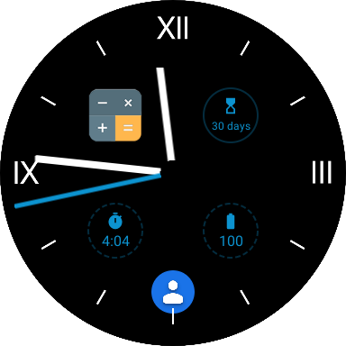

Clock View
====================

A View that displays a clock.
Supports WearOS watchfaces and widgets.




Where to Download
-----------------
```groovy
dependencies {
  implementation 'com.xlythe:clock-view:3.2.0'
}
```

Permissions
-----------------
WearOS apps require the following permissions in AndroidManifest.xml:
```xml
<uses-permission android:name="android.permission.WAKE_LOCK" />
<uses-permission android:name="com.google.android.permission.PROVIDE_BACKGROUND" />
<uses-permission android:name="com.google.android.wearable.permission.RECEIVE_COMPLICATION_DATA" />
<uses-feature android:name="android.hardware.type.watch" android:required="false" />
```

Widgets targeting Android 14 (API level 34) or higher should include the exact alarm permission:
```xml
<uses-permission android:name="android.permission.SCHEDULE_EXACT_ALARM" />
```

Clock
-----------------
`Clock` is a Composable for displaying time.

`Clock` includes optional parameters for drawable resources (`clockFaceRes`, `hourHandRes`, `minuteHandRes`, `secondHandRes`) and digital text styling (`digitalTextColor`, `digitalTextSizeSp`), along with attributes `clockStyle` [analog, digital], `showSeconds`, `showMilliseconds`, `partialRotation`, `lowBitAmbient`, `hasBurnInProtection`, and `ambientModeEnabled`.

```kotlin
val clockController = remember { mutableStateOf<ClockController?>(null) }
Clock(
    modifier = Modifier.fillMaxSize(),
    clockStyle = ClockStyle.ANALOG,
    clockFaceRes = R.drawable.tick_roman,
    hourHandRes = R.drawable.hour_hand,
    minuteHandRes = R.drawable.minute_hand,
    secondHandRes = R.drawable.second_hand,
    digitalTextColor = Color.White,
    digitalTextSizeSp = 40f,
    showSeconds = true,
    showMilliseconds = false,
    partialRotation = false,
    lowBitAmbient = false,
    hasBurnInProtection = false,
    ambientModeEnabled = false,
    controller = clockController,
    onTimeTick = {
        // Called when time updates
    }
)
```

`Clock`'s imperative methods are exposed via `ClockController`.

Starts or stops the automatic time ticker
```kotlin
clockController.value?.start()
clockController.value?.stop()
```

Resets time tracking to system current time
```kotlin
clockController.value?.resetTime()
```

Sets a specific time imperatively
```kotlin
clockController.value?.setTime(timeInMillis)
clockController.value?.setTime(hour, minute, second)
```

ClockView
-----------------
```xml
<com.xlythe.view.clock.ClockView xmlns:android="http://schemas.android.com/apk/res/android"
    xmlns:clock="http://schemas.android.com/apk/res-auto"
    android:id="@+id/clockView"
    android:layout_width="match_parent"
    android:layout_height="match_parent"
    android:background="#ffe3e3e3">

    <TextView
        android:id="@id/clock_time"
        android:layout_width="wrap_content"
        android:layout_height="wrap_content"
        android:layout_gravity="center"
        android:textSize="40sp"
        android:textColor="#ffffffff"/>

    <ImageView
        android:src="@drawable/tick_roman"
        android:layout_width="match_parent"
        android:layout_height="match_parent" />

    <com.xlythe.view.clock.ClockHandView
        android:id="@id/clock_hours"
        android:src="@drawable/hour_hand"
        android:layout_width="wrap_content"
        android:layout_height="match_parent"
        android:layout_gravity="center_horizontal" />

    <com.xlythe.view.clock.ClockHandView
        android:id="@id/clock_minutes"
        android:src="@drawable/minute_hand"
        android:layout_width="wrap_content"
        android:layout_height="match_parent"
        android:layout_gravity="center_horizontal" />

    <com.xlythe.view.clock.ClockHandView
        android:id="@id/clock_seconds"
        android:src="@drawable/second_hand"
        android:layout_width="wrap_content"
        android:layout_height="match_parent"
        android:layout_gravity="center_horizontal" />

</com.xlythe.view.clock.ClockView>
```

A hand turns about the middle of its own view, so art drawn on a face-sized canvas needs nothing
else: whatever the canvas puts in the middle is what the hand turns about. That costs a canvas of
transparent pixels around every hand, which compresses to almost nothing in the APK and to nothing
at all once decoded - a 45x1000 hour hand is 180kB of bitmap to draw 45x299 of art.

Art cropped to the hand can say where the crop came from instead. The view still covers the whole
face and still turns about the middle of it; only where the art is drawn changes:

```xml
<com.xlythe.view.clock.ClockHandView
    android:id="@id/clock_hours"
    android:src="@drawable/hour_hand"
    android:layout_width="match_parent"
    android:layout_height="match_parent"
    clock:handOffsetX="0.477"
    clock:handOffsetY="0.201"
    clock:handWidth="0.045"
    clock:handHeight="0.299" />
```

Every value is a fraction of the view, so they are the numbers the crop was taken with: rows 201
to 500 of a thousand-pixel canvas is `handOffsetY="0.201"` with `handHeight="0.299"`. The middle
of the face lands wherever they put it, which is the point - inside the art for a hand carrying a
counterweight or a disc past the pivot, at the very edge of it for a hand that stops there. Call
`setHandBounds` instead when the art changes at runtime, since two hands cut from the same canvas
rarely share a crop, and `clearHandBounds` to go back to art drawn on a full canvas.

Additionally, on WearOS you can add ComplicationViews.
While in a watchface editor, the user can tap on these views to attach information to the watchface.

```xml
<com.xlythe.view.clock.ClockView xmlns:android="http://schemas.android.com/apk/res/android"
    xmlns:clock="http://schemas.android.com/apk/res-auto"
    android:id="@+id/clockView"
    android:layout_width="match_parent"
    android:layout_height="match_parent"
    android:background="#ffe3e3e3">

    <com.xlythe.view.clock.ComplicationView
        clock:complicationId="1"
        clock:complicationStyle="chip"
        clock:complicationDrawableStyle="line"
        android:tint="#0C93D0"
        android:layout_width="48dp"
        android:layout_height="48dp"
        android:layout_margin="64dp"
        android:layout_gravity="center_vertical" />

    <TextView
        android:id="@id/clock_time"
        android:layout_width="wrap_content"
        android:layout_height="wrap_content"
        android:layout_gravity="center"
        android:textSize="40sp"
        android:textColor="#ffffffff"/>

</com.xlythe.view.clock.ClockView>
```

Widget
-----------------
```xml
<receiver android:name=".MyClockWidget" >
    <intent-filter>
        <action android:name="android.appwidget.action.APPWIDGET_UPDATE" />
        <action android:name="com.xlythe.widget.clock.CLOCK_WIDGET_UPDATE" />
    </intent-filter>
    <meta-data android:name="android.appwidget.provider" android:resource="@xml/clock_widget_info" />
</receiver>
```
```xml
<appwidget-provider xmlns:android="http://schemas.android.com/apk/res/android"
    android:minWidth="@dimen/default_clock_size"
    android:minHeight="@dimen/default_clock_size"
    android:initialLayout="@layout/clock_widget"
    android:initialKeyguardLayout="@layout/clock_widget"
    android:previewImage="@drawable/widget"
    android:updatePeriodMillis="1"
    android:widgetCategory="home_screen|keyguard"
    android:resizeMode="vertical|horizontal"/>
```
```java
public class MyClockWidget extends ClockWidget {
    @Override
    public ClockView onCreateClockView(Context context) {
        return (ClockView) View.inflate(context, R.layout.clock_view, null);
    }
}
```

Watchface
-----------------
```xml
<service
    android:name=".MyWatchfaceService"
    android:label="@string/app_name"
    android:permission="android.permission.BIND_WALLPAPER" >
    <meta-data
        android:name="android.service.wallpaper"
        android:resource="@xml/watch_face" />
    <meta-data
        android:name="com.google.android.wearable.watchface.preview"
        android:resource="@drawable/ic_launcher_wear" />
    <intent-filter>
        <action android:name="android.service.wallpaper.WallpaperService" />
        <category android:name="com.google.android.wearable.watchface.category.WATCH_FACE" />
    </intent-filter>
</service>
```
```xml
<wallpaper />
```
```java
public class MyWatchfaceService extends WatchfaceService {
    @Override
    public ClockView onCreateClockView(Context context) {
        return (ClockView) View.inflate(context, R.layout.clock_view, null);
    }
}
```

Watch Face Format
-----------------
Google Play no longer installs code-based watch faces, so new watch faces use the declarative
[Watch Face Format](https://developer.android.com/training/wearables/wff) (WFF). The
`com.xlythe.watchface-format` Gradle plugin expands a templated `watchface.xml` so watch faces can
share expressions and complication layouts instead of copying them.

```groovy
// Top-level build.gradle
buildscript {
    dependencies {
        classpath 'com.xlythe:watchface-format:1.0.11'
    }
}
```

After changing the plugin, build a watch face with it, not just `gradlew :watchface-format:test`.
The tests load the expander inside the same JVM that compiled it and will happily pass over a
class the JVM later refuses: a closure that takes a primitive `double` or `float` is generated
with its local variable slots miscounted, which only fails when Gradle loads the published jar
("Bad local variable type ... double_2nd is not assignable to double"). Take a `Number`.
```groovy
// Watch face module. It must be resource-only: no code and no dependencies on modules with code.
apply plugin: 'com.android.application'
apply plugin: 'com.xlythe.watchface-format'

android {
    defaultConfig {
        minSdkVersion 33
    }
    buildTypes {
        release {
            minifyEnabled true      // R8 strips the generated R class; bundles can't contain dex.
            shrinkResources false   // Resources are referenced by name from watchface.xml.
        }
    }
}

watchFaceFormat {
    template = file('src/main/template/raw/watchface.xml')    // the default
    variables.from('src/main/template-variables/values/vars.xml')
    standardVariables = true                                  // see "Variables" below
    sharedResources.from('../ClockLibrary/src/main/res')      // art shared with a phone app or widget
}
```
Also set `android.builtInKotlin=false` in `gradle.properties`, or the bundle picks up Kotlin
metadata that Watch Face Push rejects.

`sharedResources` copies drawables, mipmaps, fonts, raw files and strings/integers/bools/colors/dimens
values, but no layouts, styles or attrs. To ship only the art a watch face uses, narrow it:
```groovy
watchFaceFormat {
    sharedResourceIncludes = ['drawable*/hand_*.png', 'values*/strings.xml']
}
```

Only what the watch face reaches is copied. A library shared with an app that has screens carries
button states, selector drawables and the frames behind an `animation-list`, none of which a watch
face can use - and if some of the art is paid for, art the face doesn't draw and the bundle
shouldn't hand out. Android's resource shrinker can't help, because it reads code and a bundle has
none, so the names are followed instead: `resource`, `icon` and `thumbnail` in the generated watch
faces, plus `@drawable/`-style references in the module's own manifests and resources, and then
whatever those reach in turn. Anything a face reaches some other way needs the walk turned off:
```groovy
watchFaceFormat {
    pruneSharedResources = false
}
```

The manifest declares the format version with a generated resource:
```xml
<manifest xmlns:android="http://schemas.android.com/apk/res/android">
    <uses-feature android:name="android.hardware.type.watch" />
    <application android:label="@string/app_name" android:hasCode="false">
        <property
            android:name="com.google.wear.watchface.format.version"
            android:value="@integer/watchface_format_version" />
        <meta-data android:name="com.google.android.wearable.standalone" android:value="true" />
    </application>
</manifest>
```

### Output
The template is written twice by default. The `wff1` variant writes WFF v1 to `res/raw` for API 33, and
the `wff2` variant writes WFF v2 to `res/raw-v34`. `@integer/watchface_format_version` is generated to
match. WFF v1 has no weather data, so `wff1` replaces every `[WEATHER.*]` data source: availability and
error flags become `0`, day flags `1`, names `""` and everything else `0`. Weather UI hidden behind
`[WEATHER.IS_AVAILABLE]` therefore stays hidden on API 33.

Adjust the defaults, add variants, or remove them:
```groovy
watchFaceFormat {
    variants {
        wff1 {
            replace('[WEATHER.TEMPERATURE]', '20')   // literal replacement in this variant only
        }
        wff4 {
            resourceQualifier = 'raw-v36'
            formatVersion = 4
        }
    }
}
```
The build fails if a template references an undefined `${VARIABLE}`, or if a WFF v1 variant still
uses `[WEATHER.*]` data sources.

In one bundle, keep every variant valid at the lowest format version. Google's memory footprint
check, which Google Play also runs, validates each `watchface.xml` in a bundle against the manifest's
format version, which resolves to the lowest one. Only data sources such as weather can differ
between variants. Also reference resources by name (`resource="hour_hand"`) rather than as
`@drawable/hour_hand`, which that check can't resolve.

To use newer schema features (for example `<Sweep frequency="SYNC_TO_DEVICE"/>` or flavors) on watches
that support them, build a bundle per format version instead:
```groovy
watchFaceFormat {
    bundlePerFormatVersion = true
    variants {
        wff1 {
            replace('<Sweep frequency="SYNC_TO_DEVICE"', '<Sweep frequency="15"')
        }
    }
}
```
Each variant becomes a product flavor (`bundleWff1Release`, `bundleWff2Release`) with its own
`res/raw/watchface.xml`, format version, minSdk (from its resource qualifier, e.g. `raw-v34` means 34)
and a version code of `versionCode * versionCodeMultiplier + formatVersion` (multiplier 10 by
default). Upload all of the bundles in the same release. Google Play gives each watch the highest
version code it supports.

Text is printed tight against its tags (`<Template>%s°<Parameter .../></Template>`), because the
Wear OS renderer draws whitespace inside text.

### Watch Face Push
To build the same watch face as a package another app can install with
[Watch Face Push](https://developer.android.com/training/wearables/watch-face-push), name the
application id it should carry:
```groovy
watchFaceFormat {
    pushApplicationId = 'com.example.marketplace.watchfacepush.scenery'
}
```
The API only installs a package named *the pushing app's package* + `.watchfacepush.` + a name, and
rejects anything else, so the part before `.watchfacepush.` has to be the package of the app doing
the pushing — a different app from this one. The build fails early if the shape is wrong.

Each variant gains a second flavor, `push` beside `store`, so `assembleWff3PushRelease` builds the
package to hand the API and the store build is untouched. Both are resource-only. Because the ids
differ, the marketplace app and the face it pushes install side by side.

Watch Face Push also wants a validation token for the package, which only Google's Watch Face Push
validation tool produces. The Android build of it
(`com.google.android.wearable.watchface.validator:validator-push-android`, on Google's Maven, and
it pulls one transitive dependency from JitPack) runs on the watch, so the pushing app can validate
the package it is holding and use the token straight away. On Wear OS 6 a marketplace gets one
slot, so after the first `addWatchFace` use `updateWatchFace` to replace it.

Three things the validator refuses, each of which it reports only on the watch:

- **Code.** The package must be resource-only, so push the release build: a debug build carries
  the R class in a dex file and fails with "APK contains files that are not allowed".
- **A format version named through a resource.** The validator reads the package from outside,
  without a resource table, and gives up on `@integer/watchface_format_version` with "Validator
  does not support the version #@id/0x7f040000". Override the property in the push flavor's own
  manifest (`src/push/AndroidManifest.xml`) with the number written out.
- **No signature.** Nothing else signs a pushed package, and AGP leaves a flavor's release build
  unsigned unless the build type names a key. Give the release build type a signing config, or
  sign the package where the pushing app picks it up.

`Watchfaces/ReflectiveScenery/WearPush` is a worked example of all three.

### Validation
Point `validator` at Google's `wff-validator.jar`, from
[google/watchface releases](https://github.com/google/watchface/releases), to check every build:
```groovy
watchFaceFormat {
    validator = file("${System.getProperty('user.home')}/tools/wff-validator.jar")
}
```
Each variant is validated against its own format version and the lowest one. Release bundles are
also checked for code (dex) automatically. Before uploading, run Google's
`memory-footprint.jar --watch-face <bundle.aab>` from the same releases page.

### Variables
Variable files hold reusable expressions:
```xml
<ItemList>
    <Item name="${IS_MORNING}"><![CDATA[ [HOUR_0_23] < 12 ]]></Item>
</ItemList>
```
In the template, `${IS_MORNING}` becomes `([HOUR_0_23] &lt; 12)`. When a placeholder is an entire
attribute value, the outer parentheses are dropped: `alpha="${ALPHA}"`.

`timeZoneCoordinates = true` defines `${LATITUDE}` and `${LONGITUDE}` from the watch's time zone.
`standardVariables = true` also adds helpers built on them, including `${IS_SUNRISE}`, `${IS_DAY}`,
`${IS_SUNSET}`, `${IS_NIGHT}`, `${GET_TRANSITION_ALPHA}`, `${PERCENT_OF_DAY}`, `${IS_MOON_FULL}` and
`${IS_WEATHER_RAINY}`. Your own variables override bundled ones with the same name. Every use is
inlined, so the sunrise and sunset helpers add a lot of XML each time they're referenced.

### Complications
`com.xlythe.ComplicationSlot` mirrors `ComplicationView` and expands into a full `ComplicationSlot`
with a layout for every complication type:
```xml
<com.xlythe.ComplicationSlot slotId="1" x="200" y="200" width="160" height="160"
    type="chip" complicationDrawableStyle="line"
    color="#FFFFFFFF" ambientColor="#FFFFFFFF"
    defaultProvider="WATCH_BATTERY" defaultProviderType="RANGED_VALUE" />
```
`complicationDrawableStyle` is `fill`, `line`, `dot` or `empty`. The colors are optional (see
`complicationColor` and `complicationAmbientColor`) and accept configuration references such as
`[CONFIGURATION.themeColor.0]`; `contentColor` and `ambientContentColor` colour what goes inside
the slot and default to the same, which a `fill` slot wants overriding so its text is not the
colour of the disc behind it. `defaultProvider` and `defaultProviderType` fill the slot until the
user picks something else.

`type` names a bundled layout:

| `type` | Shape | Suits |
| --- | --- | --- |
| `chip` | a ring with the data inside it | a slot in the body of the face |
| `arc` | a band around the bezel | a gauge along the edge |
| `background` | the whole face | a photograph behind everything |

An `arc` slot is declared by the span it covers rather than by its shape. The box is still
required, and for a band it is the box the band is drawn in, so usually the whole face:
```xml
<com.xlythe.ComplicationSlot slotId="5" x="0" y="0" width="450" height="450" type="arc"
    startAngle="150" endAngle="210" thickness="44" inset="10"
    complicationDrawableStyle="line" />
```
Angles are degrees from twelve o'clock; `direction` is `CLOCKWISE` (the default) or
`COUNTER_CLOCKWISE`. A band has no inside, so a ranged value fills along it and text curves with
it, where a chip puts the number in the middle of its ring.

Each type gets a layout written for what Wear's
[Complication reference](https://developer.android.com/training/wearables/wff/complication/complication)
says it reports, so no layout asks for data its type never sends. `RANGED_VALUE` and
`GOAL_PROGRESS` take the provider's own colour ramp from format 2, laid over the whole range with
the part past the value shaded so the fill ends in the colour of the reading; a gauge whose
provider sends no colours gets a dim full turn under the fill instead, since four units of
thickness in one colour is not a reading you can take at a glance. A passed goal holds the
completed lap back and draws the next one over it at full strength, so the lap being drawn is the
reading. `WEIGHTED_ELEMENTS` divides one ring between the provider's weights with a gap at each
division, and a provider that sends no text still gets its number written out with `numberFormat`.
From format 3 text shrinks to fit rather than ellipsing, which lets a value be set a size larger
where nothing competes with it; inside a gauge it stays a size down, because the slack is what
separates it from its label. On format 1 the types that arrived later are dropped from
`supportedTypes` and their layouts removed.

On a band the gauges are pills instead: rounded at both ends, laid end to end with a small margin
between them, and never drawn over one another or over the band's track. A ranged value or a goal
is a pill in the slot's colour for the value and a greyish-black one for the remainder, with no
colour ramp; a passed goal's remainder is the completed lap, held back. Weighted elements are a
pill each in the provider's colours. A pill is never shorter than it is thick, so a short band only
has room for a few elements - a 40° band as thick as ReflectiveScenery's fits four, which come out
as dots - and one that gets more draws nothing.

Screenshots of the band layouts on a Wear OS 6 emulator are kept in
[`watchface-format/screenshots`](watchface-format/screenshots), with the build that takes them and
checks a change against them.

On a ring, strokes are capped square, because a ring's end is its start and a round cap there is
drawn back over the ramp's first colour as a bite out of it.

Two things about bands are worth knowing, because the format's reference states neither and both
were settled by drawing them on a watch and measuring the pixels:

* `TextCircular` straddles the oval it is given rather than growing outwards from it, so a line is
  centred in a band by laying it on the band's own centre line. No correction is wanted, and one
  applied anyway moves the text by half of whatever it corrects by.
* `BoundingArc` measures its oval from the *outside* and lays its thickness inwards, where `Arc`
  puts its oval on the centre line and straddles it. Since the bounding region is also a clip,
  handing both the same oval cuts the outer half off everything the slot draws - the band's own
  stroke, and the tops of its text. The two want ovals half a thickness apart to cover the same
  band.

A slot clips what it draws, which catches rings as well: a ring laid on the slot's own box has
half its stroke outside the box and comes back half as thick with its outer edge cut flat, so the
ovals here are pulled in by a stroke's thickness. And a band's `direction` describes its text, not
its stroke - the angles are always counted forward, so an `Arc` told to run counter-clockwise
between them covers everything the band does not. Only the `TextCircular` takes the direction, and
takes its two angles the other way round to go with it.

Layouts are written in terms of three more tags, which know the slot they are in:
```xml
<com.xlythe.ComplicationText expression="[COMPLICATION.TEXT]" area="value" scale="large" />
<com.xlythe.ComplicationImage source="MONOCHROMATIC_IMAGE" area="icon" />
<com.xlythe.ComplicationArc kind="ranged" />
```
`area` is `full`, `photo`, `icon`, `glyph`, `icon_beside`, `text`, `text_beside`, `value`, `label`,
`header` or `body` in a box slot, and `full`, `arc_icon`, `arc_start` or `arc_end` in a band.
`scale` is `large`, `medium`, `small` or `tiny`, measured against the slot rather than fixed in
pixels. `ComplicationText` also takes `weight`, `maxLines`, `dim`, `curved` and `autoSizeScale`,
the scale to use from format 3, where text shrinks to fit; `ComplicationArc` takes `ranged`,
`goal` or `weighted`. To change the layouts, point `complicationTemplates` at a
directory of `complication_<type>.xml` files, which also adds types of your own.

To publish the plugin, run `./gradlew :watchface-format:publish`. For local testing, run
`./gradlew :watchface-format:publishToMavenLocal` and add `mavenLocal()` to the consuming
project's buildscript repositories.

License
-------

    Licensed under the Apache License, Version 2.0 (the "License");
    you may not use this file except in compliance with the License.
    You may obtain a copy of the License at

       http://www.apache.org/licenses/LICENSE-2.0

    Unless required by applicable law or agreed to in writing, software
    distributed under the License is distributed on an "AS IS" BASIS,
    WITHOUT WARRANTIES OR CONDITIONS OF ANY KIND, either express or implied.
    See the License for the specific language governing permissions and
    limitations under the License.
