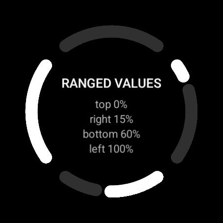
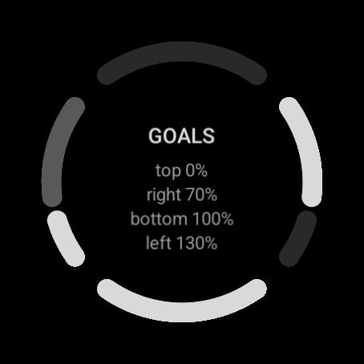
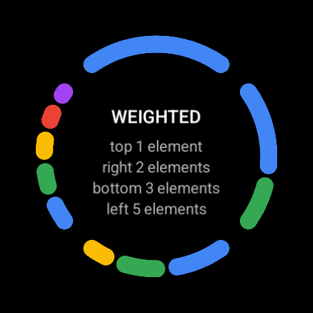
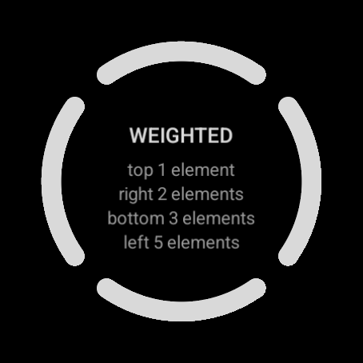

# Complication screenshots

Pictures of the `arc` complication layouts as a watch draws them, kept as goldens so a change to
the plugin shows up as a change to a picture.

Watch Face Format is drawn by the watch rather than by anything on the JVM, so these are taken on
one. This directory is its own Gradle build: it builds a watch face for each directory in
[`faces/`](faces) with the plugin in this checkout, feeds every slot from the fixed data sources
in [`provider/`](provider), photographs each face lit and in ambient, and compares the photographs
with [`goldens/`](goldens).

## Goldens

Each face has four bands, clockwise from the top, and says in the middle what each is fed.

| | Lit | Ambient |
| --- | --- | --- |
| Ranged values: 0%, 15%, 60%, 100% |  |  |
| Goals: 0%, 70%, 100%, 130% |  |  |
| Weighted elements: 1, 2, 3, 5 |  |  |

## Running

With a Wear OS device or emulator attached:

```
gradle -p watchface-format/screenshots verifyScreenshots   # fails if anything looks different
gradle -p watchface-format/screenshots recordScreenshots   # replaces the goldens with what it sees
```

`verifyScreenshots` leaves what the device showed in `build/screenshots/actual` and the pixels
that moved, in red over the golden, in `build/screenshots/diff`. When a change is meant to look
different, record, look at the new goldens, and commit them with the change.

The goldens were taken on the `wearos_large_round` emulator (454x454) running
`system-images;android-36;android-wear-signed;x86_64` (Wear OS 6), started with
`-gpu swiftshader_indirect`. Another device draws different pixels, so record on it first or use
the same one. Both builds need an SDK: `sdk.dir` in `local.properties` here and at the root of
the repository, or `ANDROID_HOME`.

Options, as `-P` properties:

- `screenshotDevice` - the serial to use when more than one device is attached (or `ANDROID_SERIAL`).
- `screenshotSettleMillis` - how long a face is given to load its data before it is photographed,
  10000 by default.
- `screenshotTolerance` - the share of pixels allowed to differ, 0.0001 by default.

## Adding a case

A face is a directory in `faces/` holding a `watchface.xml`, which the build picks up by itself.
Its slots name their data with `primaryProvider`, pointing at a class in
[`Sources.java`](provider/src/main/java/com/xlythe/watchface/screenshots/provider/Sources.java)
that is also declared, with its type, in the provider's manifest. Then record.
