# Goldens

Written by `recordScreenshots` from [`cases.groovy`](../cases.groovy); do not edit by hand.

## chip_short_text

| Lit | Ambient |
| --- | --- |
|  | 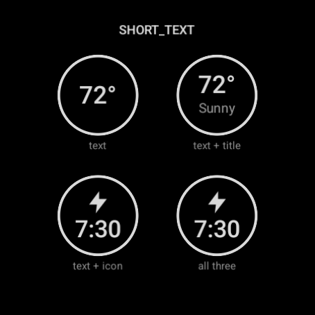 |

- **text** - type SHORT_TEXT, text 72°
- **text + title** - type SHORT_TEXT, text 72°, title Sunny
- **text + icon** - type SHORT_TEXT, text 7:30, icon true
- **all three** - type SHORT_TEXT, text 7:30, title Alarm, icon true

## chip_long_text

| Lit | Ambient |
| --- | --- |
| 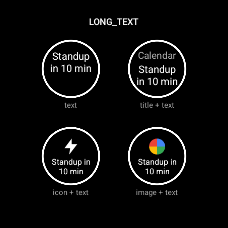 |  |

- **text** - type LONG_TEXT, text Standup in 10 min
- **title + text** - type LONG_TEXT, text Standup in 10 min, title Calendar
- **icon + text** - type LONG_TEXT, text Standup in 10 min, icon true
- **image + text** - type LONG_TEXT, text Standup in 10 min, smallImage ICON

## chip_ranged

| Lit | Ambient |
| --- | --- |
| 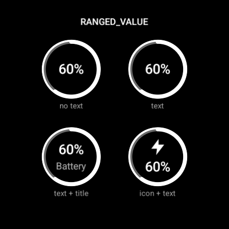 | 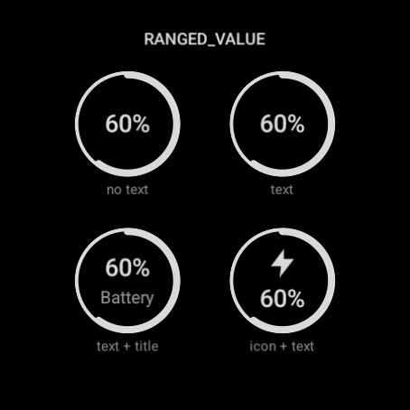 |

- **no text** - type RANGED_VALUE, value 60, min 0, max 100
- **text** - type RANGED_VALUE, value 60, min 0, max 100, text 60%
- **text + title** - type RANGED_VALUE, value 60, min 0, max 100, text 60%, title Battery
- **icon + text** - type RANGED_VALUE, value 60, min 0, max 100, text 60%, icon true

## chip_ranged_more

| Lit | Ambient |
| --- | --- |
| 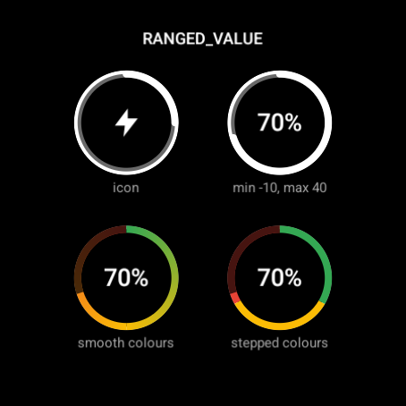 | 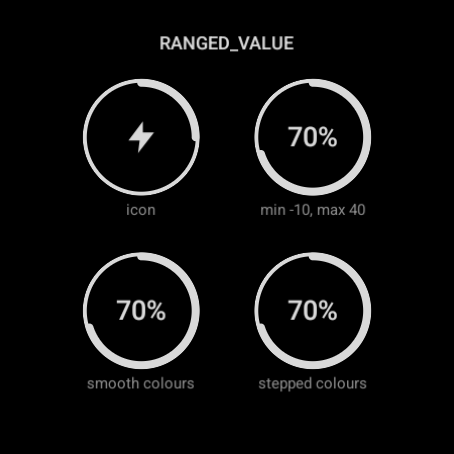 |

- **icon** - type RANGED_VALUE, value 25, min 0, max 100, icon true
- **min -10, max 40** - type RANGED_VALUE, value 25, min -10, max 40
- **smooth colours** - type RANGED_VALUE, value 70, min 0, max 100, text 70%, colors [#FF34A853, #FFFBBC05, #FFEA4335], interpolate true
- **stepped colours** - type RANGED_VALUE, value 70, min 0, max 100, text 70%, colors [#FF34A853, #FFFBBC05, #FFEA4335], interpolate false

## chip_goal

| Lit | Ambient |
| --- | --- |
| 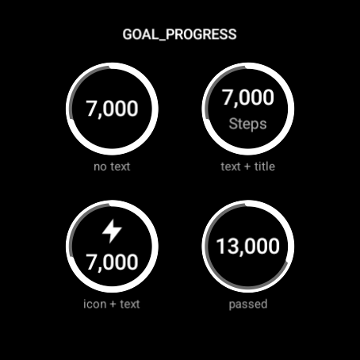 | 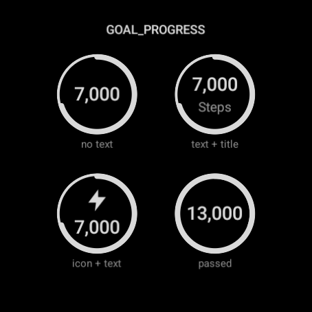 |

- **no text** - type GOAL_PROGRESS, value 7000, target 10000
- **text + title** - type GOAL_PROGRESS, value 7000, target 10000, text 7,000, title Steps
- **icon + text** - type GOAL_PROGRESS, value 7000, target 10000, text 7,000, icon true
- **passed** - type GOAL_PROGRESS, value 13000, target 10000, text 13,000

## chip_goal_more

| Lit | Ambient |
| --- | --- |
| 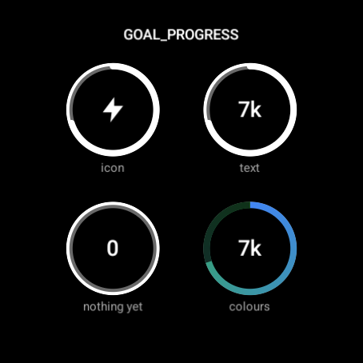 | 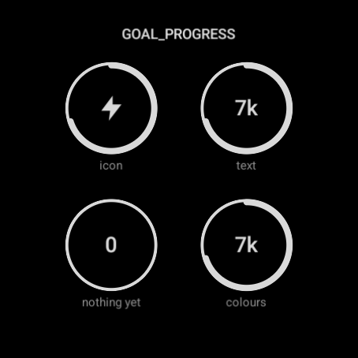 |

- **icon** - type GOAL_PROGRESS, value 7000, target 10000, icon true
- **text** - type GOAL_PROGRESS, value 7000, target 10000, text 7k
- **nothing yet** - type GOAL_PROGRESS, value 0, target 10000, text 0
- **colours** - type GOAL_PROGRESS, value 7000, target 10000, text 7k, colors [#FF4285F4, #FF34A853], interpolate true

## chip_weighted

| Lit | Ambient |
| --- | --- |
| 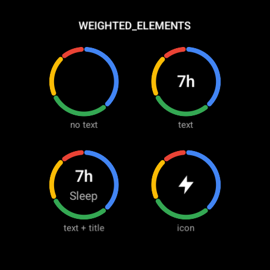 | 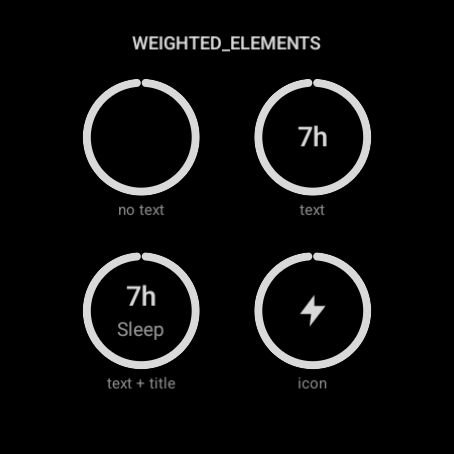 |

- **no text** - type WEIGHTED_ELEMENTS, elements [[4, #FF4285F4], [3, #FF34A853], [2, #FFFBBC05], [1, #FFEA4335]]
- **text** - type WEIGHTED_ELEMENTS, elements [[4, #FF4285F4], [3, #FF34A853], [2, #FFFBBC05], [1, #FFEA4335]], text 7h
- **text + title** - type WEIGHTED_ELEMENTS, elements [[4, #FF4285F4], [3, #FF34A853], [2, #FFFBBC05], [1, #FFEA4335]], text 7h, title Sleep
- **icon** - type WEIGHTED_ELEMENTS, elements [[4, #FF4285F4], [3, #FF34A853], [2, #FFFBBC05], [1, #FFEA4335]], icon true

## chip_weighted_more

| Lit | Ambient |
| --- | --- |
| 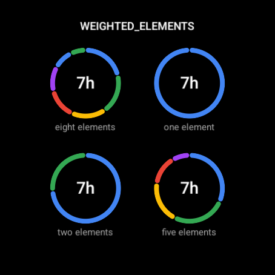 | 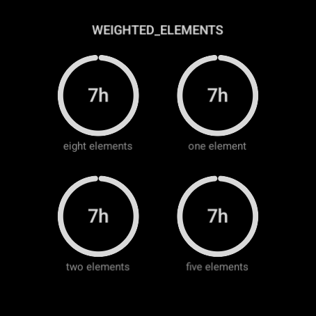 |

- **eight elements** - type WEIGHTED_ELEMENTS, text 7h, elements [[8, #FF4285F4], [7, #FF34A853], [6, #FFFBBC05], [5, #FFEA4335], [4, #FFA142F4], [3, #FF4285F4], [2, #FF34A853], [1, #FFFBBC05]]
- **one element** - type WEIGHTED_ELEMENTS, elements [[1, #FF4285F4]], text 7h
- **two elements** - type WEIGHTED_ELEMENTS, elements [[3, #FF4285F4], [1, #FF34A853]], text 7h
- **five elements** - type WEIGHTED_ELEMENTS, text 7h, elements [[5, #FF4285F4], [4, #FF34A853], [3, #FFFBBC05], [2, #FFEA4335], [1, #FFA142F4]]

## chip_images

| Lit | Ambient |
| --- | --- |
| 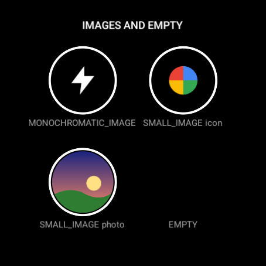 | 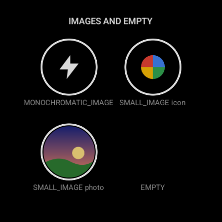 |

- **MONOCHROMATIC_IMAGE** - type MONOCHROMATIC_IMAGE, icon true
- **SMALL_IMAGE icon** - type SMALL_IMAGE, smallImage ICON
- **SMALL_IMAGE photo** - type SMALL_IMAGE, smallImage PHOTO
- **EMPTY** - no provider

## chip_styles

| Lit | Ambient |
| --- | --- |
| 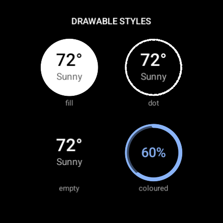 | 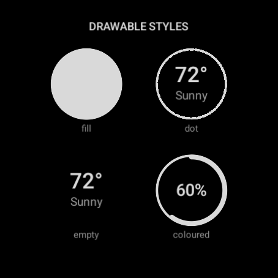 |

- **fill** - type SHORT_TEXT, text 72°, title Sunny; slot complicationDrawableStyle=fill, contentColor=#FF000000
- **dot** - type SHORT_TEXT, text 72°, title Sunny; slot complicationDrawableStyle=dot
- **empty** - type SHORT_TEXT, text 72°, title Sunny; slot complicationDrawableStyle=empty
- **coloured** - type RANGED_VALUE, value 60, min 0, max 100, text 60%; slot color=#FF8AB4F8, ambientColor=#FFFFFFFF

## arc_text

| Lit | Ambient |
| --- | --- |
| 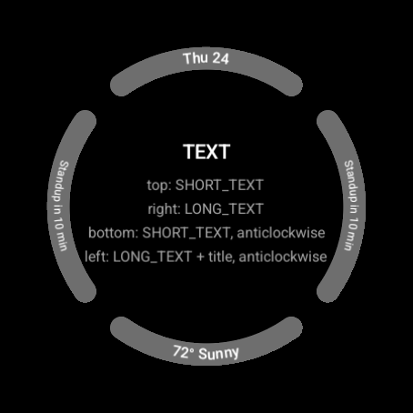 |  |

- Top: **SHORT_TEXT** - type SHORT_TEXT, text Thu 24
- Right: **LONG_TEXT** - type LONG_TEXT, text Standup in 10 min
- Bottom: **SHORT_TEXT, anticlockwise** - type SHORT_TEXT, text 72° Sunny; slot direction=COUNTER_CLOCKWISE
- Left: **LONG_TEXT + title, anticlockwise** - type LONG_TEXT, text Standup in 10 min, title Calendar; slot direction=COUNTER_CLOCKWISE

## arc_ranged

| Lit | Ambient |
| --- | --- |
| 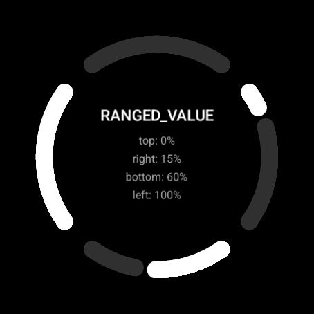 |  |

- Top: **0%** - type RANGED_VALUE, value 0, min 0, max 100
- Right: **15%** - type RANGED_VALUE, value 15, min 0, max 100
- Bottom: **60%** - type RANGED_VALUE, value 60, min 0, max 100
- Left: **100%** - type RANGED_VALUE, value 100, min 0, max 100

## arc_ranged_more

| Lit | Ambient |
| --- | --- |
| 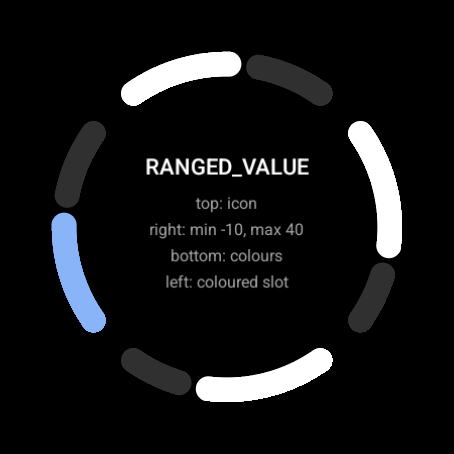 | 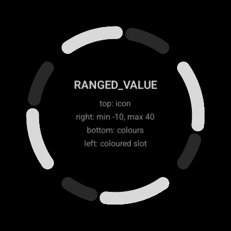 |

- Top: **icon** - type RANGED_VALUE, value 60, min 0, max 100, icon true
- Right: **min -10, max 40** - type RANGED_VALUE, value 25, min -10, max 40
- Bottom: **colours** - type RANGED_VALUE, value 70, min 0, max 100, colors [#FF34A853, #FFFBBC05, #FFEA4335], interpolate true
- Left: **coloured slot** - type RANGED_VALUE, value 60, min 0, max 100; slot color=#FF8AB4F8, ambientColor=#FFFFFFFF

## arc_goal

| Lit | Ambient |
| --- | --- |
|  | 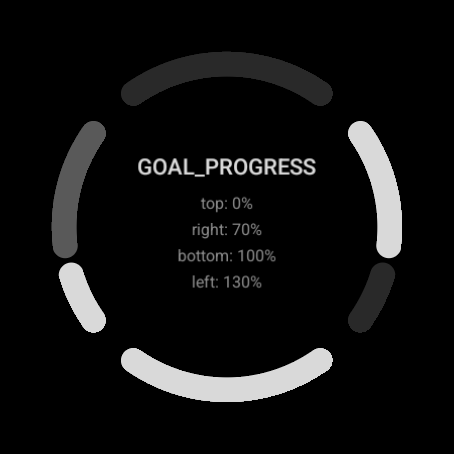 |

- Top: **0%** - type GOAL_PROGRESS, value 0, target 10000
- Right: **70%** - type GOAL_PROGRESS, value 7000, target 10000
- Bottom: **100%** - type GOAL_PROGRESS, value 10000, target 10000
- Left: **130%** - type GOAL_PROGRESS, value 13000, target 10000

## arc_weighted

| Lit | Ambient |
| --- | --- |
| 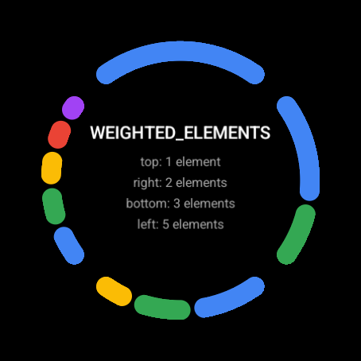 | 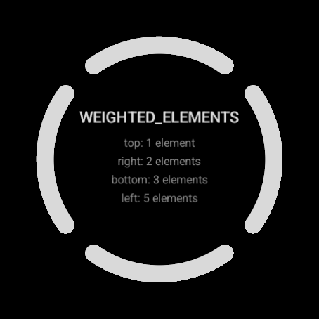 |

- Top: **1 element** - type WEIGHTED_ELEMENTS, elements [[1, #FF4285F4]]
- Right: **2 elements** - type WEIGHTED_ELEMENTS, elements [[2, #FF4285F4], [1, #FF34A853]]
- Bottom: **3 elements** - type WEIGHTED_ELEMENTS, elements [[3, #FF4285F4], [2, #FF34A853], [1, #FFFBBC05]]
- Left: **5 elements** - type WEIGHTED_ELEMENTS, elements [[5, #FF4285F4], [4, #FF34A853], [3, #FFFBBC05], [2, #FFEA4335], [1, #FFA142F4]]

## arc_images

| Lit | Ambient |
| --- | --- |
| 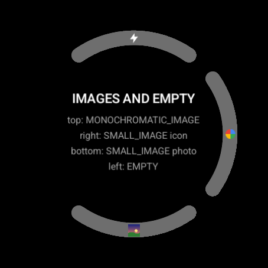 | 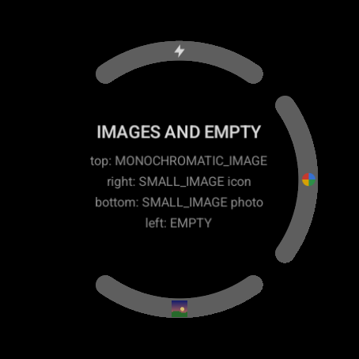 |

- Top: **MONOCHROMATIC_IMAGE** - type MONOCHROMATIC_IMAGE, icon true
- Right: **SMALL_IMAGE icon** - type SMALL_IMAGE, smallImage ICON
- Bottom: **SMALL_IMAGE photo** - type SMALL_IMAGE, smallImage PHOTO
- Left: **EMPTY** - no provider

## arc_styles

| Lit | Ambient |
| --- | --- |
| 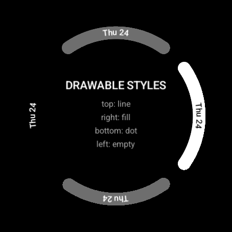 | 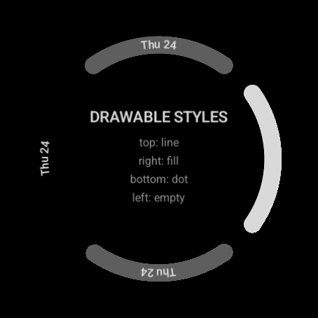 |

- Top: **line** - type SHORT_TEXT, text Thu 24
- Right: **fill** - type SHORT_TEXT, text Thu 24; slot complicationDrawableStyle=fill, contentColor=#FF000000
- Bottom: **dot** - type SHORT_TEXT, text Thu 24; slot complicationDrawableStyle=dot
- Left: **empty** - type SHORT_TEXT, text Thu 24; slot complicationDrawableStyle=empty

## background_photo

| Lit | Ambient |
| --- | --- |
| 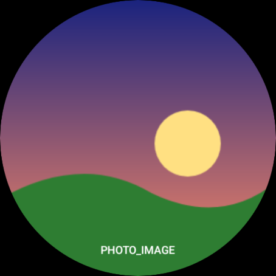 | 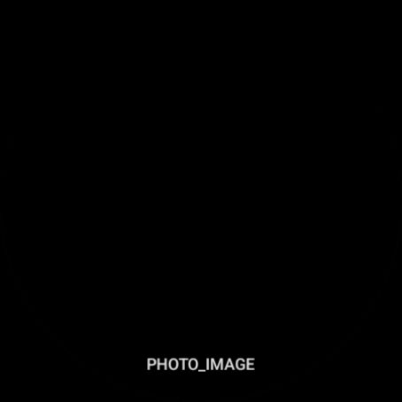 |

- **PHOTO_IMAGE** - type PHOTO_IMAGE, photo true

## background_small_image

| Lit | Ambient |
| --- | --- |
| 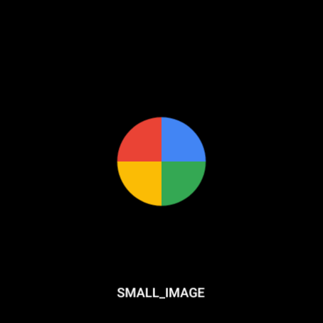 |  |

- **SMALL_IMAGE** - type SMALL_IMAGE, smallImage ICON

## background_monochromatic

| Lit | Ambient |
| --- | --- |
| 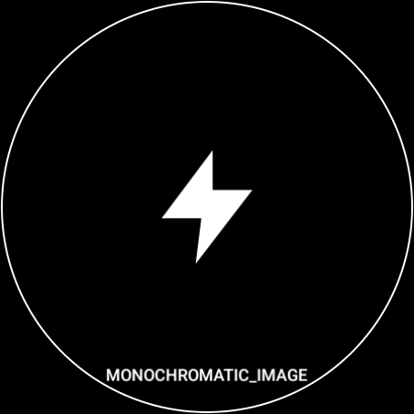 | 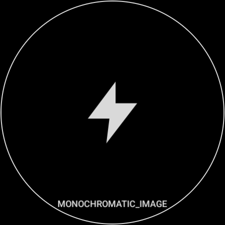 |

- **MONOCHROMATIC_IMAGE** - type MONOCHROMATIC_IMAGE, icon true

## background_empty

| Lit | Ambient |
| --- | --- |
| 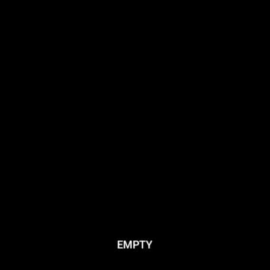 |  |

- **EMPTY** - no provider

